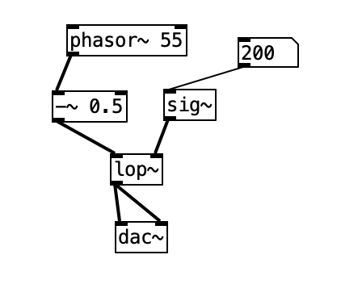
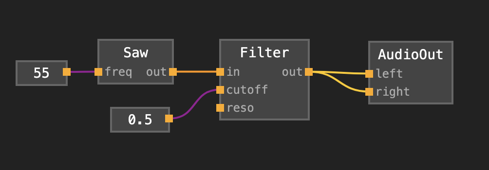
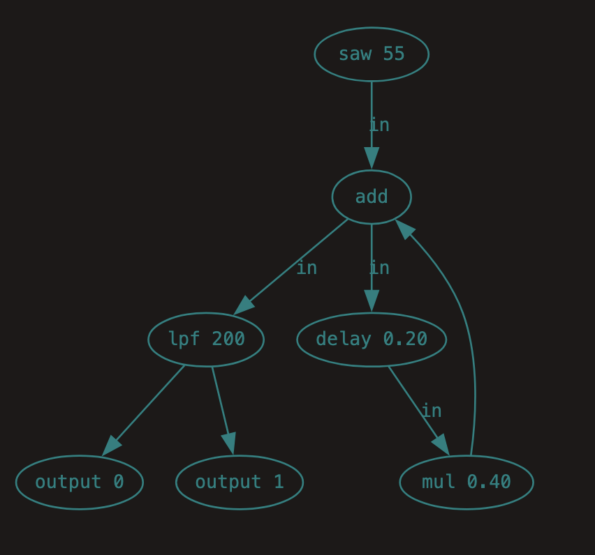
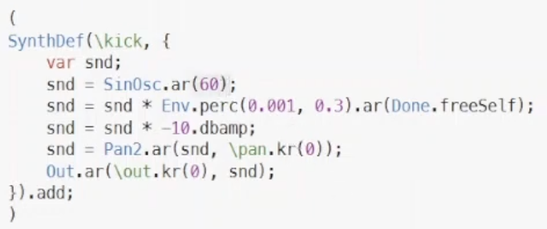
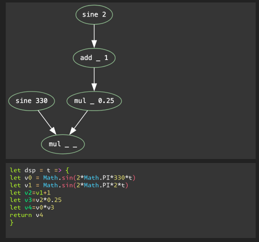

# kabelsalat

- graph based language for live coding on the web and beyond

- a project started on june 7, 2024 -> almost 1 year in the making
- paper by felix roos and raphael forment

---

kabelsalat is..

1. graph based
2. language
3. for audio-visual
4. live coding
5. on the web
6. and beyond

---

1 graph based

<!--  -->



<!--  -->

- you've seen patch based interfaces Pure Data, Max, cables.gl, noisecraft.. or modular synths
- modules + cables = graph
- each module has inputs and one or more outputs

---

2 language


- module = function
- cable = data flow

a simple chain:

```plaintext
saw 55 -> lpf 200 -> out
```

as function calls:

```plaintext
out(lpf(saw(55), 200))
```

with method chaining:

```plaintext
saw(55).lpf(200).out()
```

with intermediate variables:

```plaintext
r[0] = saw(55);
r[1] = lpf(r[0], 200)
out(r[1])
```

SuperCollider example I've found online:



```plaintext
sine(60)
.perc(.001, .3)
.mul(.4)
.pan2(sine(.4))
.out()
```

- [a graph language](https://garten.salat.dev/kabelsalat/graph-language.html)

- show Node data structure
- talk about mondo?

---

3 for audio-visual

```plaintext
sine(330)
.mul(
  sine(2).add(1).mul(.25)
).out()
```



graphs need to be compiled to the target domain, e.g. a sample processing loop or a shader.

- [a graph compiler](https://garten.salat.dev/kabelsalat/graph-compilation.html)

-> sc compilation test: /kabelsalat/graph-compilation2.html
